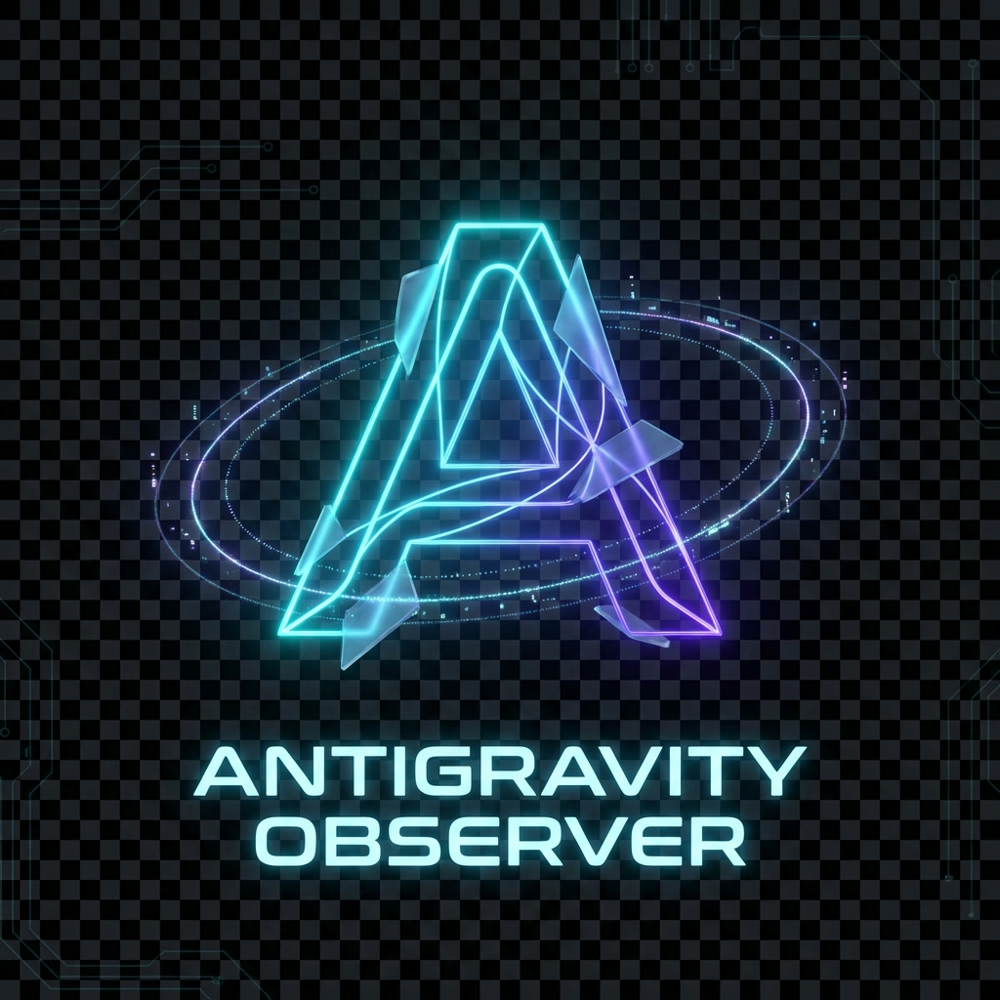

  
  
  # Antigravity Observer
  **Next-Generation Strategic Mission Control for Agentic Operations**

## Overview

Antigravity Observer is a high-performance Chrome Extension designed to monitor, analyze, and optimize local agentic workflows. It provides real-time visibility into mission progress, resource consumption, and security integrity, enabling a "Mission Control" experience for advanced developers and autonomous systems.

## Key Features

### Mission Control Interface
- **Active Mission Tracking**: Real-time progress monitoring of complex directory scans and workspace synchronizations.
- **Predictive Intelligence**: Early detection of resource bottlenecks and model optimization suggestions.
- **Security Guardrails**: Automated scanning for credential leaks and adherence to ethical AI policies.
- **Performance Metrics**: Detailed breakdown of token usage, estimated operational costs, and system latency.

### Plugin Architecture
- Seamless integration with external services through a robust registry system.
- Support for GitHub, Slack, and legacy enterprise connectors.

## Technical Specifications

- **Manifest Version**: 3 (Chrome Extension Standards)
- **Core Engine**: Optimized JavaScript architecture with event-driven updates.
- **Design System**: High-fidelity neon aesthetic with glassmorphism elements.

## Installation and Setup

1. Clone this repository to your local machine.
2. Open Chrome and navigate to `chrome://extensions`.
3. Enable **Developer Mode** in the top-right corner.
4. Click **Load unpacked** (Cargar descomprimida).
5. Select the directory containing this project.

## Security and Compliance

The system implements a multi-layer security scan during every workspace sync, including:
- Pattern-based credential leak detection.
- Ethical policy validation (Policy v2.1).
- Compliance status reporting for agent integrity.
