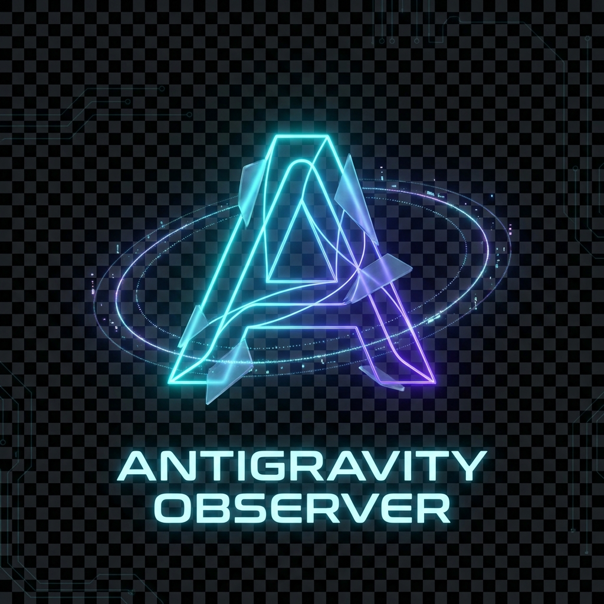

  
  
  # ANTIGRAVITY OBSERVER
**God-Tier AI Mission Control for Autonomous Agent Operations**

---

## Executive Summary

Antigravity Observer is an enterprise-grade orchestration platform for real-time monitoring and governance of autonomous systems. It transforms passive observation into **active mission control** via multi-agent intelligence and live DevOps actions.

## God-Tier Capabilities

### 1. Dual-Brain Audit System 🧠🧠
*   **Consensus Intelligence**: Simultanous auditing from Local LLMs (Ollama) and Remote Cloud Brains.
*   **CTO Live Audit**: Real-time technical assessment with one-click **GitHub Issue Generation**.
*   **UX Mission Lab**: Pro-active design optimization with direct deployment capabilities.

### 1.5. Advisory Board · Multi-Agent Council 🧑‍⚖️
A full C-level / specialist council, each role a distinct AI persona auditing every mission cycle in parallel (Local + Remote consensus), each finding shippable as a GitHub Issue in one click:

| Role | Focus |
|------|-------|
| 👔 **CEO** | Strategy, OKRs, competitive edge, ROI |
| 📈 **BDM** | Partnerships, monetization, go-to-market, growth |
| ⚖️ **Legal Senior** | GDPR/CCPA, OSS licensing, privacy, ToS |
| ⚙️ **DevOps / SRE** | CI/CD, observability, reliability, scaling |
| 📱 **Mobile** | Responsive, PWA, device performance, cross-platform parity |
| 🧪 **QA** | Edge cases, test coverage, regressions, robustness |
| 📊 **Data / Analytics** | Telemetry interpretation, KPIs, anomaly detection |

*Plus the specialized **CTO** and **UX** agents above.* Roles are data-driven via `BOARD_ROLES` in [`scripts/modules/Agents.js`](scripts/modules/Agents.js) — add a new persona by appending one object.

### 2. DevOps Mission Console 📟
*   **Live Process Streaming**: Real-time stdout/stderr capture from local tasks (npm, docker, etc.) directly into the extension.
*   **Task Orchestration**: Start and terminate local dev processes via the Bridge's secure `spawn` engine.

### 3. Mission-Critical Security
*   **Hardened Bridge**: Environment-based configuration (`.env`) with mandatory auth-token handshake.
*   **Forensic Scanner**: High-speed pattern matching for credential leak detection.
*   **Node Recycling**: Optimized DOM management for high-throughput logging.

## Architecture

The system features a **Surgical ES6 Modular Architecture**:
-   **Frontend**: Asynchronous module system (State, Bus, Bridge, Agents, Logger).
-   **Native Host**: Node.js WebSocket Bridge with **Native Messaging** auto-start capability.
-   **AI Core**: Local Ollama (`phi3:mini`) + Remote Console Consensus.

## Installation & Mission Sync

### 1. Chrome Extension
1.  Navigate to `chrome://extensions`.
2.  Enable **Developer Mode**.
3.  **Load unpacked** pointing to the project root.
4.  **Important**: Note your Extension ID for the host manifest.

### 2. Register Native Host (Auto-Start)
1.  Open `/bridge/host-manifest.json` and paste your Extension ID.
2.  Run `bridge/register-host.bat` as **Administrator**.
3.  The mission bridge will now launch automatically with Chrome.

### 3. Manual Bridge Setup
1.  Navigate to `/bridge`.
2.  Copy `bridge/.env.example` to `bridge/.env` and fill in the values.
3.  Run `antigravity-bridge.exe` or `npm start`.

> **Security: AUTH_TOKEN.** The `AUTH_TOKEN` in `bridge/.env` must be a **unique, strong secret** — no default is shipped anymore, and the legacy `antgr_secret_v1_99` value is publicly known (the Bridge will warn loudly if it detects it). It **must match** the token configured in the extension (Plugins > Mission Security, or the **GENERATE STRONG TOKEN** button). See [`bridge/.env.example`](bridge/.env.example) for the full template.

## Technical Specifications

| Objective | Specification |
|-----------|---------------|
| Architecture | ES6 Modular / EventBus |
| AI Engine | Dual-Brain (Ollama + Remote) |
| DevOps | Live Process Streaming (Spawn) |
| Security | ENV Hardened / Native Messaging |
| Aesthetics | Mission Control (Glassmorphism) |

---

  Propiedad de Antigravity AI Operations. God-Tier Status: ENABLED.

